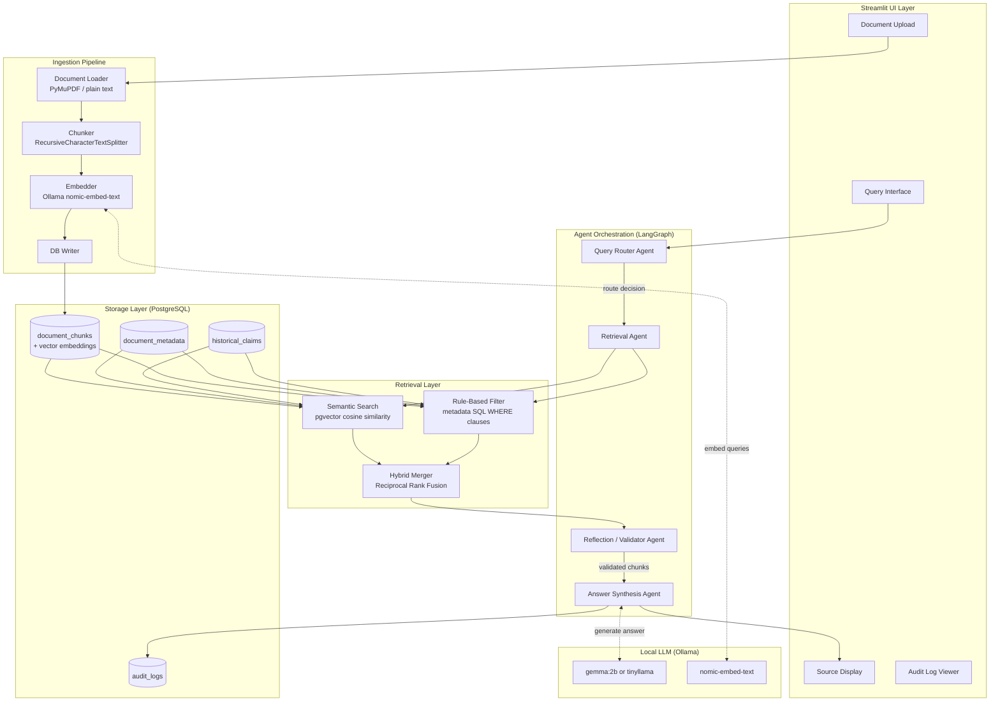
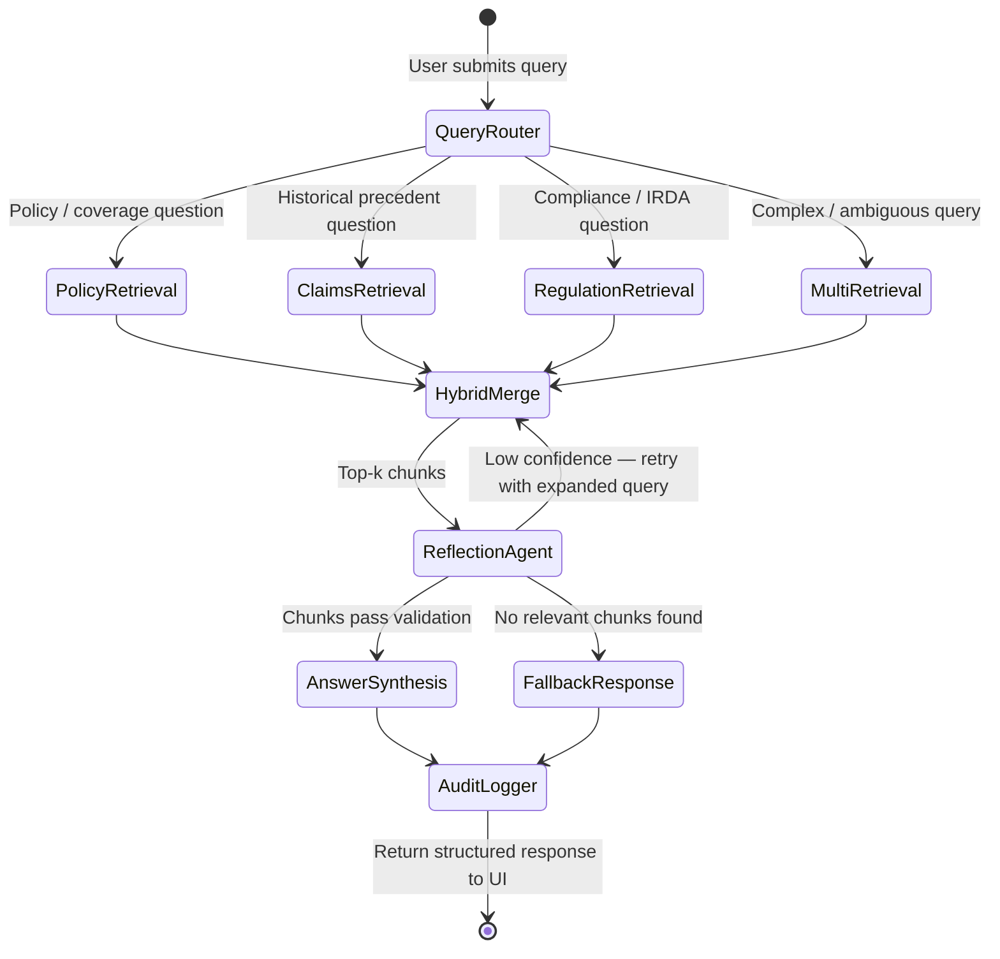
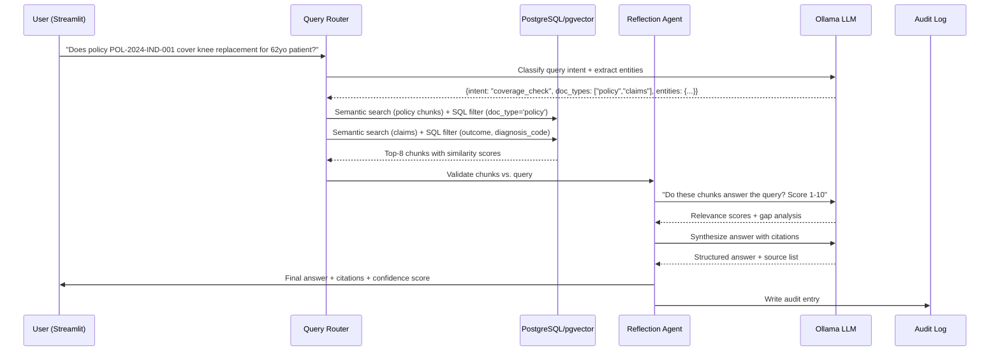

# Agentic RAG System — Medical Insurance Policy Analysis
## Implementation Blueprint

> **Status**: Awaiting user approval  
> **Target**: Portfolio project — 100% local, no cloud APIs, no real PHI

---

## Background

Hospital insurance department staff spend hours cross-referencing patient cases against policy documents, provider agreements, historical claims, and IRDA guidelines. This system automates that process using a locally-running agentic RAG pipeline: the user describes a patient case in plain English, and the system retrieves relevant policy clauses, similar historical claims, and applicable regulations — then generates a structured recommendation with citations.

---

## User Review Required

> [!IMPORTANT]
> **LLM Choice impacts everything downstream.** `gemma:2b` (≈1.5GB VRAM) gives better reasoning; `tinyllama` (≈640MB) is faster but weaker at instruction-following. Embedding model `nomic-embed-text` (≈274MB) is recommended regardless of chat model choice. Please confirm which chat model to use before Phase 1 starts.

> [!WARNING]
> **MongoDB must be installed locally.** This plan assumes you can run MongoDB with native vector search support (MongoDB 6.0+). If not available, we can fall back to ChromaDB (file-based, zero setup). Please confirm MongoDB availability.

> [!NOTE]
> All synthetic data will use obviously fictional patient names, policy numbers, and amounts. No real PHI will ever be used.

---

## Open Questions

1. **LLM**: `gemma:2b` (better quality) or `tinyllama` (faster, lower RAM)?
2. **Database**: PostgreSQL + pgvector confirmed, or fallback to ChromaDB?
3. **Embedding dimension**: `nomic-embed-text` produces 768-dim vectors. Acceptable?
4. **Synthetic data format**: Generate as raw `.txt` files (simpler) or simulate `.pdf` files?
5. **UI language**: English only, or should the UI accommodate Hindi/regional languages for IRDA documents?

---

## Proposed Architecture

### High-Level Component Diagram



### Agent Workflow (LangGraph State Machine)



### Data Flow — Single Query



---

## Project Structure

```
insurance/
├── README.md
├── requirements.txt
├── .env.example                    # DB credentials template (no secrets)
├── setup.py                        # One-command setup script
│
├── data/
│   ├── raw/                        # Source documents (txt/pdf)
│   │   ├── policies/
│   │   ├── provider_agreements/
│   │   ├── historical_claims/
│   │   └── regulations/
│   └── synthetic/                  # Generated synthetic data lives here
│
├── scripts/
│   ├── generate_synthetic_data.py  # Phase 1: Create all synthetic docs
│   ├── setup_database.py           # Phase 1: Init PostgreSQL schema
│   ├── ingest_documents.py         # Phase 2: Run full ingestion pipeline
│   └── verify_setup.py             # Smoke test — checks Ollama + DB
│
├── src/
│   ├── __init__.py
│   ├── config.py                   # Central config (loaded from .env)
│   │
│   ├── ingestion/
│   │   ├── __init__.py
│   │   ├── loader.py               # PDF + text document loader
│   │   ├── chunker.py              # Chunking strategies
│   │   └── embedder.py             # Ollama embedding wrapper
│   │
│   ├── database/
│   │   ├── __init__.py
│   │   ├── schema.sql              # Full DDL
│   │   ├── connection.py           # SQLAlchemy engine + session
│   │   ├── models.py               # ORM models
│   │   └── vector_store.py         # pgvector read/write operations
│   │
│   ├── agents/
│   │   ├── __init__.py
│   │   ├── state.py                # LangGraph shared state TypedDict
│   │   ├── query_router.py         # Intent classification + entity extraction
│   │   ├── retrieval_agent.py      # Hybrid retrieval logic
│   │   ├── reflection_agent.py     # Validation + confidence scoring
│   │   ├── answer_agent.py         # Final answer synthesis
│   │   └── graph.py                # LangGraph workflow assembly
│   │
│   ├── retrieval/
│   │   ├── __init__.py
│   │   ├── semantic.py             # pgvector ANN search
│   │   ├── rule_filter.py          # SQL metadata filtering
│   │   └── hybrid.py               # Reciprocal Rank Fusion merger
│   │
│   └── audit/
│       ├── __init__.py
│       └── logger.py               # Structured audit log writer
│
├── ui/
│   ├── app.py                      # Main Streamlit entrypoint
│   ├── pages/
│   │   ├── 01_query.py             # Query interface
│   │   ├── 02_documents.py         # Document management / upload
│   │   └── 03_audit_log.py         # Compliance audit viewer
│   └── components/
│       ├── chat_display.py         # Message + citation renderer
│       ├── source_panel.py         # Retrieved chunks display
│       └── upload_form.py          # Document upload widget
│
└── tests/
    ├── test_ingestion.py
    ├── test_retrieval.py
    ├── test_agents.py
    └── sample_queries.json          # 20 test queries with expected outputs
```

---

## Dependencies

```
# requirements.txt (pinned versions)

# LLM + Embeddings
langchain==0.3.25
langchain-community==0.3.25
langchain-ollama==0.3.3
langgraph==0.4.8
ollama==0.5.1

# Vector DB + PostgreSQL
psycopg2-binary==2.9.10
sqlalchemy==2.0.41
pgvector==0.3.6
alembic==1.16.1

# Document Processing
pymupdf==1.25.5           # PDF reading (fitz)
python-docx==1.1.2        # .docx support
unstructured==0.17.2      # Fallback multi-format loader

# Data + Utilities
pydantic==2.11.5
python-dotenv==1.1.0
numpy==2.2.6
pandas==2.2.3
faker==37.1.0             # Synthetic data generation

# UI
streamlit==1.45.1
streamlit-extras==0.5.2

# Observability
loguru==0.7.3

# Testing
pytest==8.4.0
pytest-asyncio==1.0.0
```

---

## Database Schema

```sql
-- schema.sql

-- Enable extension
CREATE EXTENSION IF NOT EXISTS vector;
CREATE EXTENSION IF NOT EXISTS "uuid-ossp";

-- ─────────────────────────────────────────────
-- Document registry
-- ─────────────────────────────────────────────
CREATE TABLE document_metadata (
    id              UUID PRIMARY KEY DEFAULT uuid_generate_v4(),
    filename        TEXT NOT NULL,
    doc_type        TEXT NOT NULL          -- 'policy' | 'agreement' | 'claim' | 'regulation'
                    CHECK (doc_type IN ('policy','agreement','claim','regulation')),
    source_name     TEXT,                  -- e.g. "Star Health Individual Policy 2024"
    effective_date  DATE,
    policy_number   TEXT,                  -- for policies / claims
    insurer_name    TEXT,
    hospital_name   TEXT,                  -- for agreements
    ingested_at     TIMESTAMPTZ DEFAULT NOW(),
    checksum        TEXT UNIQUE,           -- SHA-256 to prevent re-ingestion
    total_chunks    INTEGER DEFAULT 0
);

-- ─────────────────────────────────────────────
-- Document chunks + vector embeddings
-- ─────────────────────────────────────────────
CREATE TABLE document_chunks (
    id              UUID PRIMARY KEY DEFAULT uuid_generate_v4(),
    document_id     UUID NOT NULL REFERENCES document_metadata(id) ON DELETE CASCADE,
    chunk_index     INTEGER NOT NULL,
    chunk_text      TEXT NOT NULL,
    embedding       VECTOR(768),           -- nomic-embed-text output dimension
    page_number     INTEGER,
    section_header  TEXT,                  -- e.g. "Clause 4.2 — Exclusions"
    token_count     INTEGER,
    created_at      TIMESTAMPTZ DEFAULT NOW()
);

-- ANN index for fast cosine similarity search
CREATE INDEX ON document_chunks
    USING ivfflat (embedding vector_cosine_ops)
    WITH (lists = 100);

-- ─────────────────────────────────────────────
-- Historical claims (structured + searchable)
-- ─────────────────────────────────────────────
CREATE TABLE historical_claims (
    id              UUID PRIMARY KEY DEFAULT uuid_generate_v4(),
    claim_id        TEXT UNIQUE NOT NULL,  -- e.g. "CLM-2024-00142"
    patient_name    TEXT,                  -- synthetic only
    age             INTEGER,
    diagnosis_code  TEXT,                  -- ICD-10 code
    diagnosis_desc  TEXT,
    procedure_code  TEXT,                  -- CPT/ICD procedure
    procedure_desc  TEXT,
    claimed_amount  NUMERIC(12,2),
    approved_amount NUMERIC(12,2),
    outcome         TEXT CHECK (outcome IN ('approved','rejected','partially_approved')),
    rejection_reason TEXT,
    policy_number   TEXT,
    insurer_name    TEXT,
    claim_date      DATE,
    decision_date   DATE,
    decision_notes  TEXT,
    document_id     UUID REFERENCES document_metadata(id)
);

-- ─────────────────────────────────────────────
-- Audit log (compliance)
-- ─────────────────────────────────────────────
CREATE TABLE audit_logs (
    id              UUID PRIMARY KEY DEFAULT uuid_generate_v4(),
    session_id      TEXT NOT NULL,
    query_text      TEXT NOT NULL,
    query_intent    TEXT,
    retrieved_chunk_ids  UUID[],
    answer_text     TEXT,
    confidence_score NUMERIC(4,3),
    reflection_notes TEXT,
    response_time_ms INTEGER,
    created_at      TIMESTAMPTZ DEFAULT NOW()
);

-- ─────────────────────────────────────────────
-- Indexes for performance
-- ─────────────────────────────────────────────
CREATE INDEX idx_chunks_doc_id    ON document_chunks(document_id);
CREATE INDEX idx_chunks_section   ON document_chunks(section_header);
CREATE INDEX idx_meta_doc_type    ON document_metadata(doc_type);
CREATE INDEX idx_meta_policy_num  ON document_metadata(policy_number);
CREATE INDEX idx_claims_outcome   ON historical_claims(outcome);
CREATE INDEX idx_claims_diagnosis ON historical_claims(diagnosis_code);
CREATE INDEX idx_audit_session    ON audit_logs(session_id);
CREATE INDEX idx_audit_created    ON audit_logs(created_at);
```

---

## Synthetic Data Generation Strategy

### Answer to Q1: How to generate realistic synthetic insurance data?

We use a **template-driven + Faker-randomized** approach:

1. **Policy documents**: Fixed clause structure (Definitions → Coverage → Exclusions → Claim Procedure → Grievance) filled with randomized patient limits, waiting periods, and co-pay percentages.
2. **Historical claims**: Drawn from a curated pool of 30 ICD-10 codes (common Indian diagnoses — dengue, appendectomy, CABG, knee replacement, cataract). Faker generates patient names, amounts are randomized within realistic INR ranges.
3. **Provider agreements**: Use a hospital-TPA negotiation template with randomized discount rates per procedure category.
4. **IRDA regulations**: Paraphrased summaries of publicly available IRDA circulars (fictional circular numbers, realistic rule text).

### Document Volume

| Category | Count | Approx. Tokens | Chunks (est.) |
|---|---|---|---|
| Insurance Policies | 4 | ~8,000 each | ~40/doc = 160 |
| Provider Agreements | 3 | ~5,000 each | ~25/doc = 75 |
| Historical Claims | 25 | ~500 each | ~3/doc = 75 |
| IRDA Regulations | 3 | ~4,000 each | ~20/doc = 60 |
| **Total** | **35** | **~120,000** | **~370 chunks** |

**Total vector storage**: 370 chunks × 768 floats × 4 bytes ≈ **~1.1 MB** (trivially small)

---

## Chunking Strategy

### Answer to Q2: Optimal chunking for insurance policy documents?

Insurance documents require **hierarchical-aware chunking**, not naive fixed-size chunking:

| Document Type | Strategy | Chunk Size | Overlap |
|---|---|---|---|
| Policy documents | `RecursiveCharacterTextSplitter` with section separators (`\n## `, `\nClause`) | 512 tokens | 64 tokens |
| Provider agreements | Same as policies | 512 tokens | 64 tokens |
| Historical claims | One chunk per claim (structured fields serialized to text) | ~300 tokens | 0 |
| IRDA regulations | Sentence-aware splitting at paragraph boundaries | 400 tokens | 50 tokens |

**Section headers** (e.g. "4.2 Exclusions — Pre-existing Conditions") are stored separately in `section_header` column and prepended to each chunk during embedding. This **dramatically improves retrieval precision** because the embedding captures both the context ("this is about exclusions") and the content.

**Chunk text template used during embedding:**
```
Section: {section_header}
Document: {doc_title} ({doc_type})
---
{chunk_text}
```

---

## Access Control Strategy

### Answer to Q3: Access control at the vector database level?

For this local single-user portfolio project, access control is implemented at the **application layer**, not the DB layer:

1. **Role-based document tagging**: Each `document_metadata` row has a `doc_type`. The `query_router` restricts which `doc_type` values are searched based on query context.
2. **Session-scoped audit logs**: Every query is logged with `session_id` — reviewable in the audit tab.
3. **No direct DB access from UI**: All DB interactions go through the `vector_store.py` abstraction layer.
4. **Future-proof**: PostgreSQL Row Level Security (RLS) policies can be added per-role if multi-user is needed later.

---

## Implementation Phases

### Phase 1 — Environment Setup & Data Generation (Est. 3-4 hours)

**Goals**: Working Ollama + PostgreSQL, all synthetic data on disk.

**Steps**:
1. Install Ollama: `winget install Ollama.Ollama` → pull models
2. Install PostgreSQL 16 + pgvector extension
3. Create `insurance` database and run `schema.sql`
4. Run `generate_synthetic_data.py` → 35 documents in `data/synthetic/`
5. Run `verify_setup.py` → confirms all services reachable

**Key files created**: All 35 synthetic `.txt` documents, `.env` with DB creds.

---

### Phase 2 — Data Ingestion Pipeline (Est. 2-3 hours)

**Goals**: All documents chunked, embedded, and stored in pgvector.

**Steps**:
1. Build `loader.py` — reads `.txt` and `.pdf` files, extracts section headers with regex
2. Build `chunker.py` — applies per-doc-type chunking strategy (table above)
3. Build `embedder.py` — wraps `OllamaEmbeddings(model="nomic-embed-text")`
4. Build `vector_store.py` — writes chunks + embeddings to `document_chunks`
5. Run `ingest_documents.py` — processes all 35 docs, ~370 chunks

**Critical code pattern — embedder**:
```python
from langchain_ollama import OllamaEmbeddings

embedder = OllamaEmbeddings(model="nomic-embed-text", base_url="http://localhost:11434")

def embed_chunks(chunks: list[str]) -> list[list[float]]:
    return embedder.embed_documents(chunks)  # batched, returns list of 768-dim vectors
```

---

### Phase 3 — Vector Storage & Hybrid Retrieval (Est. 3-4 hours)

**Goals**: Fast, accurate retrieval combining semantic + rule-based filtering.

**Semantic search** (pgvector):
```python
# semantic.py — core query
def semantic_search(query_embedding: list[float], doc_types: list[str], top_k: int = 8):
    return session.execute(text("""
        SELECT dc.id, dc.chunk_text, dc.section_header, dm.doc_type, dm.source_name,
               1 - (dc.embedding <=> :qvec) AS similarity
        FROM document_chunks dc
        JOIN document_metadata dm ON dc.document_id = dm.id
        WHERE dm.doc_type = ANY(:doc_types)
        ORDER BY dc.embedding <=> :qvec
        LIMIT :top_k
    """), {"qvec": str(query_embedding), "doc_types": doc_types, "top_k": top_k})
```

**Hybrid Retrieval** uses **Reciprocal Rank Fusion (RRF)**:
```python
def reciprocal_rank_fusion(semantic_results, rule_results, k=60):
    scores = {}
    for rank, doc in enumerate(semantic_results):
        scores[doc.id] = scores.get(doc.id, 0) + 1/(k + rank + 1)
    for rank, doc in enumerate(rule_results):
        scores[doc.id] = scores.get(doc.id, 0) + 1/(k + rank + 1)
    return sorted(scores.items(), key=lambda x: x[1], reverse=True)
```

---

### Phase 4 — Query Routing Agent (Est. 3-4 hours)

**Goals**: Intelligent routing to the right document type, entity extraction.

### Answer to Q4: How does routing work?

The `query_router` does **two things in one LLM call**:

1. **Intent classification** → which doc types to search
2. **Entity extraction** → pull out policy numbers, diagnosis codes, procedure names, amounts

**Router prompt template**:
```
You are an insurance query classifier. Analyze this query and return JSON only.

Query: {query}

Return this exact JSON structure:
{
  "intent": "coverage_check" | "claims_precedent" | "regulatory_compliance" | "general",
  "doc_types": ["policy", "claims", "regulation", "agreement"],  // which to search
  "entities": {
    "policy_number": null or "string",
    "diagnosis": null or "string",
    "procedure": null or "string",
    "patient_age": null or integer,
    "amount": null or number
  },
  "reasoning": "brief explanation"
}
```

**Routing logic matrix**:

| Query contains... | Routes to |
|---|---|
| "does policy cover", "is X covered" | policy + claims |
| "similar cases", "precedent", "approved before" | claims |
| "IRDA", "regulation", "mandatory", "circular" | regulation |
| "hospital agreement", "TPA rate", "cashless" | agreement |
| "recommend", "what should I do" | all doc types |

---

### Phase 5 — Reflection Agent (Est. 2-3 hours)

**Goals**: Validate retrieved chunks are actually relevant; score confidence; handle no-result case.

### Answer to Q5: How does reflection work?

The reflection agent runs **before** the final answer is generated:

```
You are an insurance document auditor. You received a user query and retrieved context.
Evaluate whether the context is sufficient to answer the query.

Query: {query}
Retrieved Chunks: {chunks}

Respond with JSON:
{
  "is_sufficient": true/false,
  "confidence": 0.0-1.0,
  "gaps": ["what is missing"],
  "recommendation": "answer" | "expand_search" | "fallback"
}
```

**Three outcomes**:
- `confidence >= 0.7` → proceed to answer synthesis
- `0.4 <= confidence < 0.7` → retry with expanded query (add synonyms, broaden doc_types)
- `confidence < 0.4` → fallback response: "Insufficient policy data found. Please consult the original policy document or contact your TPA representative."

### Answer to Q7: Handling no relevant documents

The fallback response template is structured and always honest:
```
⚠️ **Insufficient Information Retrieved**

I could not find sufficient policy documentation to answer your query with confidence.

**Query**: {query}
**Documents searched**: {doc_types searched}
**Closest match found**: {best_chunk_summary if any}

**Recommended next steps**:
1. Upload the relevant policy document using the Documents tab
2. Rephrase your query with more specific policy/procedure details
3. Contact your TPA representative directly for this query
```

---

### Phase 6 — UI Development (Est. 4-5 hours)

**Goals**: Clean, professional Streamlit UI with 3 pages.

**Page 1 — Query Interface** (`01_query.py`):
- Left panel: Chat history with user/assistant messages
- Right panel: Collapsible "Source Documents" showing retrieved chunks with similarity scores
- Bottom: Confidence meter (color-coded: green/yellow/red)
- "Explain Reasoning" toggle → shows router decision + reflection notes

**Page 2 — Document Management** (`02_documents.py`):
- File uploader (PDF/TXT, max 50MB)
- Ingestion status table (filename, doc_type, chunks created, date)
- Re-index button per document

**Page 3 — Audit Log** (`03_audit_log.py`):
- Filterable table of all queries (date, query, intent, confidence)
- Click to expand → full answer + sources retrieved

### Answer to Q6: Storing and displaying citations

Each answer is returned as a structured object:
```python
@dataclass
class InsuranceAnswer:
    answer_text: str
    confidence: float
    citations: list[Citation]    # chunk_id, doc_name, section, similarity_score, snippet
    reasoning: str               # Router + reflection reasoning chain
    recommendation: str          # "Approve" | "Reject" | "Escalate" | "Needs more info"
```

Citations are rendered in the UI as expandable cards:
```
📄 Star Health Individual Policy 2024 — Section 4.2 Exclusions
   Similarity: 0.87 | "Pre-existing conditions have a 48-month waiting period..."
```

### Answer to Q8: Explaining reasoning

The `reasoning` field is populated by the router and reflection agents:
```
🔍 Query Router Decision:
   Intent: coverage_check
   Searched: policies (primary), claims (secondary)
   Entities found: diagnosis=knee replacement, patient_age=62

🔎 Reflection Agent Assessment:
   Found 3 relevant policy clauses and 2 similar historical claims
   Confidence: 0.82 — Sufficient to answer

💡 Recommendation: CONDITIONAL APPROVAL
   Coverage exists but subject to pre-authorization and co-pay clause 6.1
```

---

### Phase 7 — Testing & Integration (Est. 2-3 hours)

**Goals**: End-to-end smoke tests, 10 sample query validations.

---

## Security & Compliance Measures

1. **No real PHI**: All data is synthetic with clearly fictional identifiers
2. **Local-only**: No network calls except `localhost:11434` (Ollama) and `localhost:5432` (PostgreSQL)
3. **Audit trail**: Every query, retrieved chunk, and generated answer is logged immutably
4. **`.env` file**: Database credentials stored in `.env`, never committed to git (`.gitignore`)
5. **Input sanitization**: SQL queries use parameterized statements (SQLAlchemy ORM), preventing injection
6. **Checksum deduplication**: SHA-256 checksums prevent the same document from being ingested twice with different embeddings

---

## Testing Strategy

### Sample Queries & Expected Outputs

```json
[
  {
    "id": "Q001",
    "query": "Does the Star Health Individual policy cover knee replacement surgery for a 62-year-old patient?",
    "expected_intent": "coverage_check",
    "expected_doc_types": ["policy", "claims"],
    "expected_recommendation": "CONDITIONAL_APPROVAL",
    "key_facts": ["waiting period check", "age limit check", "sub-limit for joint replacement"]
  },
  {
    "id": "Q002",
    "query": "Show me historical cases where cardiac bypass surgery claims were rejected",
    "expected_intent": "claims_precedent",
    "expected_doc_types": ["claims"],
    "expected_recommendation": "INFORMATIONAL"
  },
  {
    "id": "Q003",
    "query": "What does IRDA say about pre-authorization timelines for cashless hospitalization?",
    "expected_intent": "regulatory_compliance",
    "expected_doc_types": ["regulation"],
    "expected_recommendation": "INFORMATIONAL"
  },
  {
    "id": "Q004",
    "query": "A patient with Type 2 diabetes wants to claim for dialysis. The policy is 2 years old. What should we do?",
    "expected_intent": "coverage_check",
    "expected_doc_types": ["policy", "claims", "regulation"],
    "expected_recommendation": "CONDITIONAL_APPROVAL",
    "key_facts": ["diabetes exclusion period", "dialysis sub-limit", "pre-existing condition waiting period"]
  },
  {
    "id": "Q005",
    "query": "What is the TPA discount rate for ICU procedures at our network hospitals?",
    "expected_intent": "agreement_lookup",
    "expected_doc_types": ["agreement"],
    "expected_recommendation": "INFORMATIONAL"
  }
]
```

### Automated Test Commands
```bash
pytest tests/ -v                    # All unit tests
pytest tests/test_retrieval.py -v   # Retrieval accuracy only
python scripts/verify_setup.py      # End-to-end smoke test
```

---

## Resource Requirements

| Component | RAM Usage | Disk | Notes |
|---|---|---|---|
| Ollama (gemma:2b) | ~1.8 GB | 1.5 GB | Active inference |
| Ollama (tinyllama) | ~640 MB | 640 MB | Alternative |
| nomic-embed-text | ~274 MB | 274 MB | Always loaded |
| PostgreSQL + pgvector | ~200 MB | ~50 MB data | Mostly disk-based |
| Streamlit app | ~150 MB | — | Python process |
| **Total (gemma:2b)** | **~2.4 GB** | **~2 GB** | Within 4GB target |
| **Total (tinyllama)** | **~1.2 GB** | **~1 GB** | Comfortable on 2GB |

### Performance Expectations (local laptop, CPU only)

| Operation | Estimated Time |
|---|---|
| Embed one chunk (nomic-embed-text) | ~50ms |
| Ingest all 35 documents | ~3-5 minutes |
| Semantic search (370 chunks) | <50ms |
| LLM response (gemma:2b) | 15-45 seconds |
| Full query pipeline (router → retrieval → reflection → answer) | ~60-120 seconds |

> [!TIP]
> If response time is too slow, skip the reflection agent for simple queries (when router confidence is high) to save one LLM round-trip. This can cut total time by ~40%.

---

## Deployment Instructions (Local)

```bash
# 1. Install Ollama (Windows)
winget install Ollama.Ollama
ollama pull gemma:2b
ollama pull nomic-embed-text

# 2. Install PostgreSQL 16 + pgvector
# Download from https://www.postgresql.org/download/windows/
# Then in psql: CREATE EXTENSION vector;

# 3. Clone project and install dependencies
cd C:\Users\Asus\Desktop\insurance
pip install -r requirements.txt

# 4. Configure environment
copy .env.example .env
# Edit .env: set DB_HOST, DB_PORT, DB_NAME, DB_USER, DB_PASSWORD

# 5. Initialize database
python scripts/setup_database.py

# 6. Generate synthetic data
python scripts/generate_synthetic_data.py

# 7. Ingest all documents
python scripts/ingest_documents.py

# 8. Launch UI
streamlit run ui/app.py
# Open http://localhost:8501
```

---

## Execution Sequence Summary

| Phase | Est. Time | Key Deliverable |
|---|---|---|
| 1 — Environment + Data | 3-4 hrs | Ollama running, DB ready, 35 synthetic docs |
| 2 — Ingestion Pipeline | 2-3 hrs | All documents chunked + embedded in pgvector |
| 3 — Vector Retrieval | 3-4 hrs | Hybrid semantic + SQL retrieval working |
| 4 — Query Routing Agent | 3-4 hrs | Intent classification + entity extraction |
| 5 — Reflection Agent | 2-3 hrs | Confidence scoring + fallback handling |
| 6 — Streamlit UI | 4-5 hrs | 3-page UI with chat + sources + audit log |
| 7 — Testing | 2-3 hrs | All 5 sample queries passing |
| **Total** | **~19-26 hrs** | **Working portfolio system** |

---

*Awaiting your approval and answers to the Open Questions above before execution begins.*
